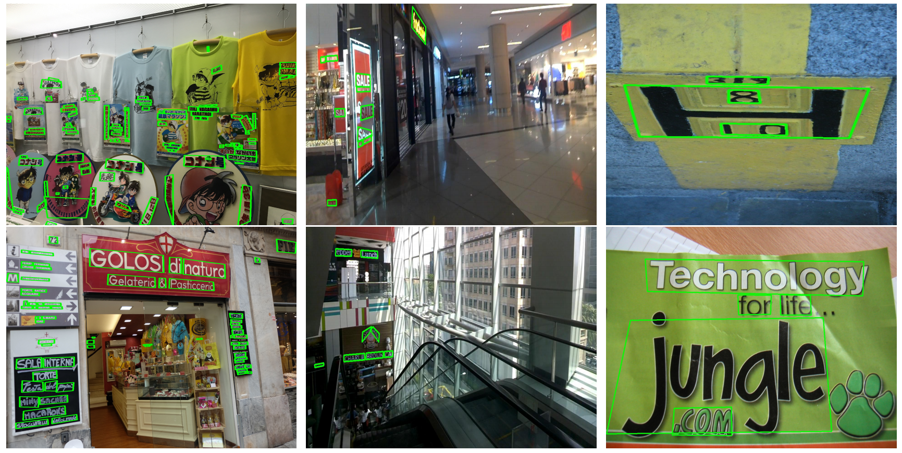

# PMTD: Pyramid Mask Text Detector
This project hosts the inference code for implementing the PMTD algorithm for text detection, as presented in our paper:

    Pyramid Mask Text Detector;
    Liu Jingchao, Liu Xuebo, Sheng Jie, Liang Ding, Li Xin and Liu Qingjie;
    arXiv preprint arXiv:1903.11800 (2019).

The full paper is available at: [https://arxiv.org/abs/1903.11800](https://arxiv.org/abs/1903.11800).



## Installation
Check [INSTALL.md](INSTALL.md) for installation instructions.

## Trained model
We provide trained model on ICDAR 2017 MLT dataset [here](https://drive.google.com/open?id=1kh5wXqvD1KkaSLtyEG8RUDUfSK1CHnQT) and ICDAR 2015 dataset [here](https://drive.google.com/open?id=1hI6uDaUefCrD1oYoKMdflTY6Ocl2Y46-) for downloading. Note that the result is slightly different from we reported in the paper, because PMTD is based on a private codebase, we reimplement inference code based on [maskrcnn-benchmark](https://github.com/facebookresearch/maskrcnn-benchmark).

ICDAR 2017  

Method|Precision|  Recall|    F-measure
---|---|---|---
This project|85.13%|72.85%|    78.51%
Paper reported|85.15%| 72.77%| 78.48%

ICDAR 2015  

Method|Precision|	Recall|	F-measure
---|---|---|---
This project|87.48%|91.26%|	89.33%
Paper reported|87.43%| 91.30%| 89.33%

## A quick demo

```bash
cd PROJECT_ROOT
python demo/PMTD_demo.py \
--image_path=datasets/icdar2017mlt/ch8_validation_images/img_1.jpg \
--model_path=models/PMTD_ICDAR2017MLT.pth
```

## Perform testing on ICDAR 2017 MLT dataset

### Prepare dataset
We recommend to symlink [ICDAR 2017 MLT](http://rrc.cvc.uab.es/?ch=8) dataset to `datasets/` as follows
```bash
# eg: ~/Projects/PMTD
cd PROJECT_ROOT

mkdir -p datasets/icdar2017mlt
cd datasets/icdar2017mlt

# symlink for images and annotations
ln -s /path_to_icdar2017mlt_dataset/ch8_test_images
```

### Generate coco label for dataset
```bash
# ${PWD} = datasets/icdar2017mlt
mkdir annotations
cd PROJECT_ROOT
python demo/utils/generate_icdar2017.py
# label will output to PROJECT_ROOT/datasets/icdar2017mlt/annotations/test_coco.json
```

### Test images
In the test stage, we use one GPU of TITANX 11G with a batch size 4. When encountering the out-of-memory (OOM) error, you may need to modify TEST.IMS_PER_BATCH in `configs/e2e_PMTD_R_50_FPN_1x_test.yaml`.
```bash
# the download model should place in the path: models/PMTD_ICDAR2017MLT.pth
python tools/test_net.py --config=configs/e2e_PMTD_R_50_FPN_1x_ICDAR2017MLT_test.yaml
# results will output to PROJECT_ROOT/inference/icdar_2017_mlt_test/
# - bbox.json // when using coco evaluation criterion
# - segm.json // when using coco evaluation criterion
# - dataset.pth
# - predictions.pth
# - results_{scale}.pth, in default setting, scale=1600
```

### Convert results to ICDAR 2017 submission format
```bash
python demo/utils/convert_results_to_icdar.py
# results will output to PROJECT_ROOT/inference/icdar_2017_mlt_test/
# - icdar.zip
```

### submit icdar.zip to [ICDAR 2017 MLT](http://rrc.cvc.uab.es/?ch=8)

## Citations
Please consider citing our paper in your publications if this project helps your research. BibTeX reference is as follows.
```bibtex
@article{liu2019pyramid,
  title={Pyramid Mask Text Detector},
  author={Liu, Jingchao and Liu, Xuebo and Sheng, Jie and Liang, Ding and Li, Xin and Liu, Qingjie},
  journal={arXiv preprint arXiv:1903.11800},
  year={2019}
}
```

## Contributors

- [Jingchao Liu](https://github.com/JingChaoLiu)
- [Xuebo Liu](https://github.com/liuxuebo0)

## License
Maskrcnn-benchmark is released under the MIT license. PMTD is released under the [Apache 2.0 license](LICENSE).
